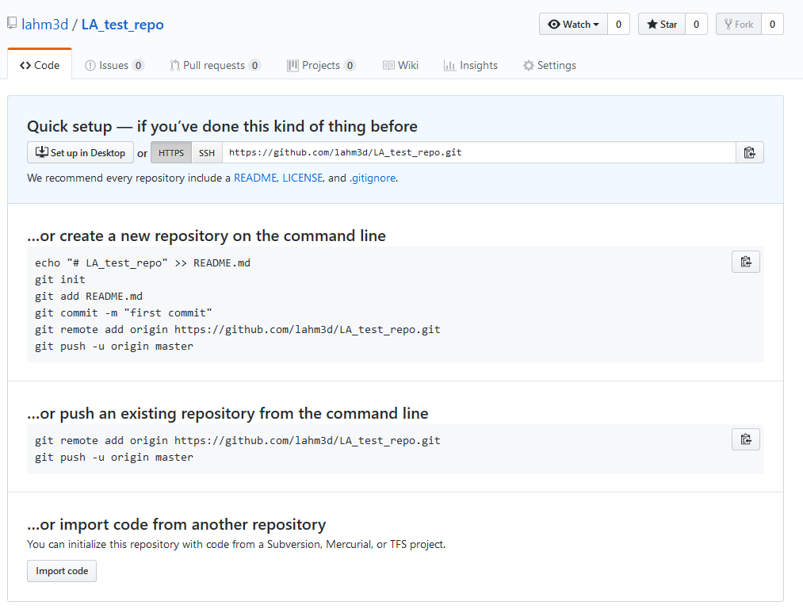

# Day 02

## 05 - Working with GitHub
On day 01, we looked at a simple Git workflow which works when you are working on a project on your personal workstation and you're the only contributor. Now say you want to work in a group and want to collaborate with others you need a distributed version control system (DVCS). This what services like GitHub, GitLab or BitBucket provide you. 

In this section, we will learn:
1. Create a repository on GitHub
2. GitHub and BitBucket: Tutorials and resources
3. Collaborating on GitHub

**Note: repository, repo, project folder are all interchangeable , but repo will be used most often in this document**
### Create a repository on GitHub

There are two methods of creating a repository and we go through both of them on how to create a repository on GitHub:
1. Move local Git repository to GitHub
2. Create a new repository on GitHub from scratch

#### Moving local repository to GitHub

1. Open a Git terminal, and make sure you're in the `C:\...\git-projects` folder
2. Create an empty folder in following format: `<your-initials>_test_repo` e.g. `LA_test_repo`

    ```sh
    $ pwd
    /d/git_projects

    $ mkdir LA_test_repo
    ```
3. Now we are going to navigate to `C:\...\git-projects\LA_test_repo`, initilize it, and check its status:

    ```sh
    $ cd LA_test_repo
    $ git init
    $ git status
    ```
4. Now that we have an empty repo, we will make this repo available on GitHub
5. Open github.com, login and click **New Repository**
6. Under **Repository name** copy and paste name of the git project folder or repo that you've created exactly as it is: **(your-initials)_test_repo**. 
7. If you like you can add some description (though it is optional)
8. Set it to **Public**, because **Private** repos are available on paid accounts only 
9. Ignore all the other options, but in future remember when you do create a repository on GitHub you can automatically generate the following files: README, .gitignore, and a license file
10. Click **Create repository**, and you have created an empty placeholder location on GitHub. This allows us to either `push` a local repository to GitHub, or if you want you can create a new repository using the same process on GitHub from scratch (*We will get to the term `push` shortly, just remember it is a Git command*)
11. You should see the follow options on your screen:

<!--  -->


+ First option: 'create a new repository on the command line', you are basically using your terminal window to type the commands to create a repository from scratch
+ Second option: 'push an existing repository from the command line', this means you already have a local repository and you want to `push` it to GitHub
+ Third option is not relevant but if you were importing your project/repo from a different version control you would use this
12. We are going to go with second option because we already have an existing repo. While doing this we will break down the commands involved in this process:

    ```sh
    $ git remote add origin https://github.com/lahm3d/LA_test_repo.git
    ```
    + What is `remote`? A Git repository stored on a server somewhere either by GitHub or BitBucket, so when you `git remote add` you're telling your Git repo: 'Hey, when I put this file on GitHub this is where it should go!'
    + Think of Git as a tree with branches:
        + The local branch or main branch of Git is named by default as `master`
        + When you create remote repo like on GitHub this branch will be named `origin/master`
    + Finally, the URL `https://github.com/lahm3d/LA_test_repo.git` is just a path of where the `.git` folder will be located
    + Don't worry if you don't get all of this, there are more detailed resources in **Branching** section

    ```sh
    $ git push -u origin master
    ```
    + `push` is a Git command that tells Git to push your repo (basically upload the repo) to the remote URL that was set in the last step
    + We'll cover `pull` command shortly, but the reason why you type `git push -u origin master` for the initial push is to make your future pull requests easy. The `-u` or `upstream` flag or argument tells: 'Hey Git, I'm pushing all my changes to origin/master on my GitHub repo, so when you pull (basically download the repo) make sure you do it from origin/master branch'
    + For all future, pushes on your Git repo you can type `git push origin`

13. Okay, let's add a remote which btw you only need to do it once unless you change name of your repo, and push our changes

14. Now, go to your GitHub and see if we were able to successfully push the changes. Now if you like, you can create a `README.md`, add some text and commit, and push it to GitHub:

    ```sh
    $ echo "OMG I'm on GITHUB!" > README.md
    $ git add README.md
    $ git commit -m 'added readme'
    $ git push origin
    ```
Let's put all this into a simple workflow (This assumes you've already added a remote and made the initial push):
1. Add file:    `git add abc.txt`
2. Commit file:     `git commit -m 'added abc.txt'`
3. Push changes to GitHub:  `git push origin` 

### GitHub and BitBucket: Tutorials and resources

If you want to learn what each of the platforms offer, the links to their tutorials and various resources are provided below. These resources include tutorials, cheatsheets, and various resources:

+ [GitHub Learning Resources](https://services.github.com/on-demand/resources/)
+ [BitBucket documentation](https://confluence.atlassian.com/bitbucket/bitbucket-cloud-documentation-221448814.html)


*Note: `master` is the default local branch git creates, `origin` is the default name of your remote repository. For more detailed explanation read: [Git branching](https://git-scm.com/book/en/v2/Git-Branching-Branches-in-a-Nutshell), [Stackoverflow](https://stackoverflow.com/questions/18137175/in-git-what-is-the-difference-between-origin-master-vs-origin-master#18137512)*