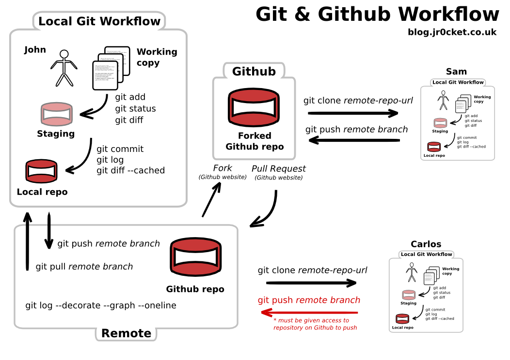

# Day 02

## 05 - Working with GitHub
On day 01, we looked at a simple Git workflow which works when you are working on a project on your personal workstation and you're the only contributor. Now say you want to work in a group and want to collaborate with others you need a distributed version control system (DVCS). This what services like GitHub, GitLab or BitBucket provide you. 

In this section, we will learn:
1. Create a repository on GitHub
2. GitHub and BitBucket: Tutorials and resources

**Note: repository, repo, project folder are all interchangeable , but repo will be used most often in this document**
### Create a repository on GitHub

There are two methods of creating a repository and we go through both of them on how to create a repository on GitHub:
1. Move local Git repository to GitHub
2. Create a new repository on GitHub from scratch

#### Moving local repository to GitHub

1. Open a Git terminal, and make sure you're in the `C:\...\git_projects` folder
2. Create an empty folder in following format: `<your-initials>_test_repo` e.g. `LA_test_repo`

    ```sh
    $ pwd
    /d/git_projects

    $ mkdir LA_test_repo
    ```
3. Now we are going to navigate to `C:\...\git_projects\LA_test_repo`, initilize it, and check its status:

    ```sh
    $ cd LA_test_repo
    $ git init
    $ git status
    ```
4. Now that we have an empty repo, we will make this repo available on GitHub
5. Open github.com, login and click **New Repository**
6. Under **Repository name** copy and paste name of the git project folder or repo that you've created exactly as it is: **(your-initials)_test_repo**. 
7. If you like you can add some description (though it is optional)
8. Set it to **Public**, because **Private** repos are available on paid accounts only 
9. Ignore all the other options, but in future remember when you do create a repository on GitHub you can automatically generate the following files: README, .gitignore, and a license file
10. Click **Create repository**, and you have created an empty placeholder location on GitHub. This allows us to either `push` a local repository to GitHub, or if you want you can create a new repository using the same process on GitHub from scratch (*We will get to the term `push` shortly, just remember it is a Git command*)
11. You should see the follow options on your screen:

<!--  -->


+ First option: 'create a new repository on the command line', you are basically using your terminal window to type the commands to create a repository from scratch
+ Second option: 'push an existing repository from the command line', this means you already have a local repository and you want to `push` it to GitHub
+ Third option is not relevant but if you were importing your project/repo from a different version control you would use this
12. We are going to go with second option because we already have an existing repo. While doing this we will break down the commands involved in this process:

    ```sh
    $ git remote add origin https://github.com/lahm3d/LA_test_repo.git
    ```
    + What is `remote`? A Git repository stored on a server somewhere either by GitHub or BitBucket, so when you `git remote add` you're telling your Git repo: 'Hey, when I put this file on GitHub this is where it should go!'
    + Think of Git as a tree with branches:
        + The local branch or main branch of Git is named by default as `master`
        + When you create remote repo like on GitHub this branch will be named `origin/master`
    + Finally, the URL `https://github.com/lahm3d/LA_test_repo.git` is just a path of where the `.git` folder will be located
    + Don't worry if you don't get all of this, there are more detailed resources in **Branching** section

    ```sh
    $ git push -u origin master
    ```
    + `push` is a Git command that tells Git to push your repo (basically upload the repo) to the remote URL that was set in the last step
    + We'll cover `pull` command shortly, but the reason why you type `git push -u origin master` for the initial push is to make your future pull requests easy. The `-u` or `upstream` flag or argument tells: 'Hey Git, I'm pushing all my changes to origin/master on my GitHub repo, so when you pull (basically download the repo) make sure you do it from origin/master branch'
    + For all future, pushes on your Git repo you can type `git push origin`

13. Okay, let's add a remote which btw you only need to do it once unless you change name of your repo, and push our changes

14. Now, go to your GitHub and see if we were able to successfully push the changes. Now if you like, you can create a `README.md`, add some text and commit, and push it to GitHub:

    ```sh
    $ echo "OMG I'm on GITHUB!" > README.md
    $ git add README.md
    $ git commit -m 'added readme'
    $ git push origin
    ```
Let's put all this into a simple workflow (This assumes you've already added a remote and made the initial push):
1. Add file:    `git add abc.txt`
2. Commit file:     `git commit -m 'added abc.txt'`
3. Push changes to GitHub:  `git push origin` 

### GitHub and BitBucket: Tutorials and resources

If you want to learn what each of the platforms offer, the links to their tutorials and various resources are provided below. These resources include tutorials, cheatsheets, and various resources:

+ [GitHub Learning Resources](https://services.github.com/on-demand/resources/)
+ [BitBucket documentation](https://confluence.atlassian.com/bitbucket/bitbucket-cloud-documentation-221448814.html)

## 06 - Collaborating with Git & GitHub

In this section, we will perform a simple group exercise where one member sets up a repo on GitHub and adds the other team member as a **Collaborator**, and we will perform a simple GitHub collaboration workflow:

1. Pair up with the person sitting next to you: one person should be the author or owner (i.e. person creating the repo) and other should be the 'collaborator'
2. The author or owner will create a new repository on GitHub and name it whatever they please, be creative. This time you can add a `README.md` or `.gitignore` if you choose
3. Adding collaborators (on the repo page):
    + Click on **Settings** > **Collaborators** > search for username of your partner, and after you find them click **Add collaborator**
    + The collaborator should recieve an email inviting them to collaborate, and you need to **accept** the invitiation 
4. Now the collaborator can start making contributions on the repo, but before they can do that they need to **fork** the repo and then **clone** it. 
5. So what the hell is **fork**-ing and **clon**(e)ing:
    + Clone, or cloning is making a copy of any remote repository from GitHub or BitBucket. When you clone a project you download a copy all the files plus `.git` folder to your local computer. This means you can work on a project from multiple computers as long as you push changes to GitHub after you're done making changes
    + Fork, or forking is making a copy of a repo on GitHub. Similar to cloning, but say you found an interesting project and you want to contribute it then you'd fork the repo. We'll see how this plays out in context of a workflow later on.
    + Do I fork or clone? Well, it really depends. 
        + If you just want to look at the code but not interested in contributing you can just clone the project
        + If you are a contributor you can clone and just push to the repo directly, but this can get messy with multiple people. Especially, if you want to review the code that is being pushed to the repo
    + Also, fork is a service GitHub provides to its users, not a Git command. However, `clone` is a Git command

6. What should we do first fork or clone? The usual workflow goes something like this:
    1. Fork a project (now it is on your GitHub repo)
    2. Clone the project from your GitHub to your local computer
    3. Make changes i.e. add and commit
    4. Push the changes to your GitHub repo (because you do not have write privileges on other's repos)
    5. Make a pull request from your updated repo on GitHub to original GitHub repo for the project
    6. Let's try to how we can do this and replicate this workflow!

7.  The collaborators need to follow the following steps:
    1. Fork the repo created by your partner, it should take a few minutes
    2. This is how you identify your forked repo on GitHub, if you look at the bottom it says *forked from username/repo-name* that is the original location of the original repo. `230fd0hf` is just a dummy account that was made for demonstration, this is where your username should appear:

        
    3. Now we are going to clone the remote and make sure you're in the main 'git_projects' folder. First copy the HTTPS url from the drop down menu and paste it after `git clone https://github.com/xxx.git` (see below):
        
        

        ```sh
        $ pwd
        /c/git_projects
        $ git clone https://github.com/username/name-of-repo-your-partner-created.git
        ```

    4. Check your folder, you should see main repo folder with all the files that were created by your partner
    5. Now open the `README.md` file in the repo, add the following text in the file and save changes:

        ```
        ### Contributor
        first-name last-name
        ```
    6. Let's add and commit the file (don't forget to add remote and make initial push since this is our first push locally):

        ```sh
        $ git add README.md
        $ git commit -m 'Added contributor name'
        $ git remote add origin https://github.com/username/name-of-repo-your-partner-created.git
        $ git push -u origin master
        ```
    
    7. Great! You've pushed changes to your forked repo. Next we are going to look at how to perform a pull request:
        + Pull request are performed from your repo to original repo, you are requesting the owner of the original repo to review your code and accept or reject any changes you've made to the repo
        + You can perform a pull request through a few command lines, but we will use GitHub's feature rich interface
    
    8. Navigate to your forked repo page, not the main repo page on GitHub. It should look something similar to below and then click 'New pull request':

        

    9. Before we can initiate a pull request, we need to tell Git what repo and branches we are merging together. Let's break this down:
        + base fork: the original repo you forked
        + base: master (the branch on the original repo you're requesting changes to be merged)
        + head fork: your forked repo with latest edit
        + compare: master (the branch on your forked repo where you've made changes)
        + click **'Create new pull request'**
        + You'll be prompted to add a title and a comment for the pull request, add something appropriate. click **'Create new pull request'** again to complete the process

        

        + If your partner is a collaborator then they do not need to wait for the owner to merge the changes, they can merge it themselves by clicking on 'Merge pull request' (see below)

        

        +  The above option will not appear on collaborator's screen, if their partner removed them as a collaborator. You will need to wait for the owner's permission to merge the changes into repo
        
        + The collaboration dynamics will vary dramatically where some allow others complete access, and some prefer to control what goes into the main repo with good reason as well. Last thing you want is people making changes to published code/project
    
    10. The absolultely last thing we, or the owner, needs to do is execute a `pull command to complete the circle. This moves all the changes made to his remote repo on GitHub to his local copy

        ```sh
        $ git pull origin master
        ```
        Again, we are pulling Git repo from our remote branch `origin` and that's it! We've updated our local repo with any change made by the collaborators. 
        
A finishing noteote, you don't want to always `push` and `pull` all the time. You want to a review process, set some standards, and ground rules on whaht is eligible for pushing and pulling without polluting the main repository. When your workflow starts to become more complex and/or you have several collaborators then you will need to carefully think about how you want to `push` and `pull` things selectively which Git can certainly do.
    
### Putting it all together:


#### [Source](http://blog.podrezo.com/git-introduction-for-cvssvntfs-users/)



#### [Source](http://jr0cket.co.uk/2013/08/getting-to-grips-with-git-understanding-the-simple-workflow.html.html)

### Additional sources:
+ [Connect your Bitbucket or Github account](https://confluence.atlassian.com/get-started-with-sourcetree/connect-your-bitbucket-or-github-account-847359096.html)
+ [Set up an SSH key](https://confluence.atlassian.com/bitbucket/set-up-an-ssh-key-728138079.html)
+ [StackOverflow: Forking vs. Branching in GitHub](https://stackoverflow.com/questions/3611256/forking-vs-branching-in-github)
+ [GitHub: Creating a pull request](https://help.github.com/articles/creating-a-pull-request/)
+ [StackOverflow: How to do a GitHub pull request](https://stackoverflow.com/questions/14680711/how-to-do-a-github-pull-request#14681796)
+ [How to write the perfect pull request](https://blog.github.com/2015-01-21-how-to-write-the-perfect-pull-request/)
+ [Differences between “git pull” commands when pulling from origin?](https://stackoverflow.com/questions/15797183/differences-between-git-pull-commands-when-pulling-from-origin)

## 07 - Branching in Git

In this section, we will look at basics of branching in Git. Think of Git as trunk of a tree and as you make changes such as add more features or fix bugs you can create branches that address these issues. Without changing the main branch, and you don't want to change the main branch until you've fully tested these features and bugs out completely. We will cover how you can combine or merge branches in next section.

For simpliicity, we created a separate repo for demonstrating branching in Git:

1. Navigate to your `git_projects` folder and type the following commands to clone branching repo to get started:

    ```sh
    $ pwd
    /c/git_projects
    $ git clone https://github.com/lahm3d/branch_exercise.git
    $ cd branch_exercise
    $ ls
    months.txt
    ```
2. The only item in the `branch_exercise` folder is a file named `months.txt`, open this file in your text editor and you should see names of months in a year

3. We are going to create a branch called 'seasons', switch over to the branch, make some changes and add-commit the changes

    To create a branch and list all branches in a repo:
    ```sh
    $ git branch seasons
    $ git branch -l
    ```
    
    This should be your output:
    ```sh
    * master
    seasons
    ```
   + Asterix (`*`) indicates active branch, we are on the `master` branch
   + We just created `seasons` branch
   + Everytime, you want to add a new or an experimental feature or fix a bug, it is probably a good idea to create a separate branch, activate that branch, and then work on it

    The command to activate a branch is `git checkout branch-name`, let's check out `seasons` and make changes:

    ```sh
    lahmed@USGS1 MINGW32 /d/git_projects/branch_exercise (master)
    $ git checkout seasons
    lahmed@USGS1 MINGW32 /d/git_projects/branch_exercise (seasons)
    ```
    Note: the path on your terminal window will change from `master` to `season` after checking it out

    Great, open your `months.txt` in a text editor and add the following text after December:

    ```
    seasons:
    June
    July
    August
    ```
    Now to add and commit the file on `seasons`

    ```sh
    $ git add months.txt
    $ git commit -m 'added season'
    ```
    Open `months.txt` and see the inputs, you should see the section you just added. Once you've confirmed the changes close the text file.

    Now let's switch to the `master` branch:

    ```sh
    $ git checkout master
    ```
    Let's open our text file one more time, and you should see the seasons section you added earlier is gone. This is because it is on an entirely different branch. Branching extends to creating extra folders, files and etc. Typical example of this would be creating branches such as: 
    + `production`: Where your polished project is located
    + `development`: Things that work-in-progress
    + `test`: You want to try something totally different 

Sources  
+ [Git Branching - Branches in a Nutshell](https://git-scm.com/book/en/v2/Git-Branching-Branches-in-a-Nutshell)
+ [A successful Git branching model](https://nvie.com/posts/a-successful-git-branching-model/)

## 08 - Merge vs Rebase

There are two ways you can combine or integrate changes between branches: `merge` and `rebase`

### Merge
In this section, we are going to use the structure of branching exercise and show you how you can merge two branches (or commits): `master` and `seasons`:

    ```sh
    $ git merge master seasons
    ```
In the above command, we are merging HEAD of `seasons` branch into HEAD of `master` branch. This is important to remember, whatever the latest commit you've made to your branch that is what will be merged. Now look at your `months.txt` file and you should see the summer months we added to `seasons` branch in last section

A few things to consider when merging:
+ This is a simpler example of merge, but you can add more complex merges to address specific workflows
+ Always make sure you have everything committed in your repos, merging uncommitted files will be messy!
+ When a merge fails, it means it has *conflicts*. How do you avoid conflicts?
    + Stop letting multiple people working on the same file!
    + Best way to avoid conflicts is team communication, setting ground rules and following standardization

### Rebase
Merge does a simple merge between two commits or branches. You can cherry pick and when you merge then all you get is result of merging those two specific commits, a non-linear merge. We are not going to go through on how to `rebase` but this is a wonderful explanation of [merge vs rebase](http://www.edwardthomson.com/blog/merge_vs_rebase.html)

### Sources
+ [How to avoid git conflicts in a team?](https://stackoverflow.com/questions/16490873/how-to-avoid-git-conflicts-in-a-team)
+ [Understanding Git: Merging](https://www.sbf5.com/~cduan/technical/git/git-3.shtml)
+ [Git Branching - Basic Branching and Merging](https://git-scm.com/book/en/v2/Git-Branching-Basic-Branching-and-Merging) 
+ [Git - When to Merge vs. When to Rebase](https://derekgourlay.com/blog/git-when-to-merge-vs-when-to-rebase/)
+ [git rebase: The Simple One-Minute Explanation](https://tag1consulting.com/blog/git-rebase-simple-one-minute-explanation)

### Additional sources on Git
+ [Git for beginners: The definitive practical guide](https://stackoverflow.com/questions/315911/git-for-beginners-the-definitive-practical-guide)
+ [git - the simple guide](https://rogerdudler.github.io/git-guide/)
+ [A Visual Git Reference](https://marklodato.github.io/visual-git-guide/index-en.html)
+ [Interactive Git Tutorial ](https://learngitbranching.js.org/)